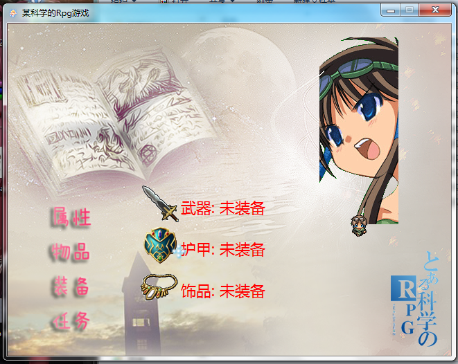

# 这是我自己在2012年的c++作品游戏作品  

# This is my first real game,inspired by RpgMaker and finished in 2012.

# Press return button to start the game.

## 这个作品的思路来自于Rpgmaker,当时自己还没有进入游戏行业,这是之前整理电脑的时候翻出来的东西~

## 用这个作品参加了66RPG网站的比赛~23333还混了一个技术奖(感觉是去砸场子的..)

---

## 因为年代太久远了,自己那时候还是萌新,所以请各位不要吐槽其中的很多东西  

## 目录也没有去整理,同时有很多中文名也请见谅..我真的那时候还是萌新 

# 上传git的初衷也是为了让自己记住勿忘初心!

## 我已经将工程升级到vs2019,可以直接编译

---

# 按回车键开始,鼠标选择菜单进入游戏

## 视频连接/Video
### [B站链接](https://www.bilibili.com/video/av339288 "B站链接")

## 部分截图/Screen Capture

